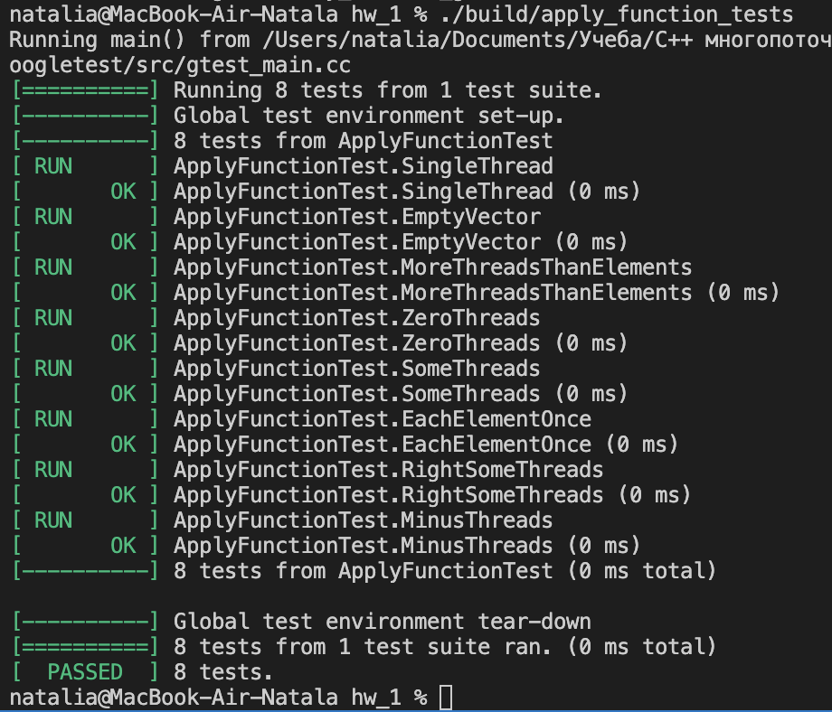
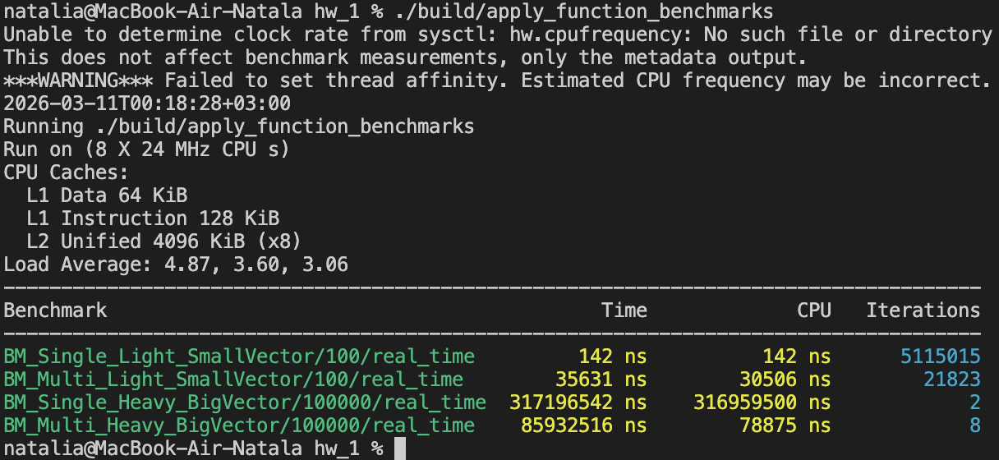

# HW1 — ApplyFunction

Реализация функции:

```cpp
template <typename T>
void ApplyFunction(std::vector<T>& data,
                   const std::function<void(T&)>& transform,
                   const int threadCount = 1);
```
Сборка из hw_1:
```bash
cmake -S . -B build
cmake --build build  
```

Результат запуска тестов:
```bash
./build/apply_function_tests
```


Результат запуска бенчмарка:
```bash
./build/apply_function_benchmarks
```

