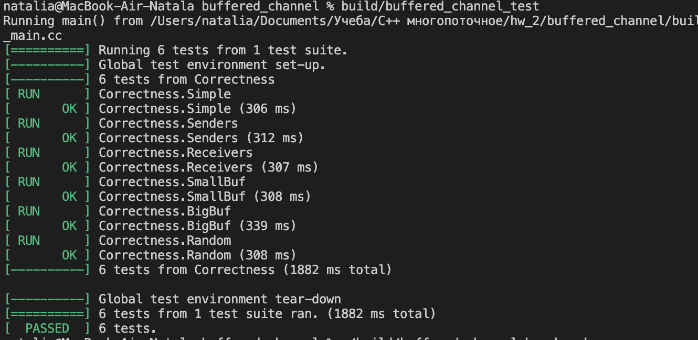
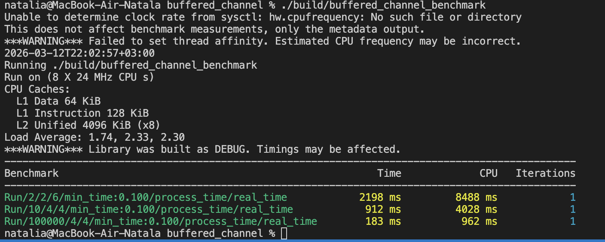

# HW2 — BufferedChannel

Реализация класса:

```cpp
template <class T>
class BufferedChannel {}
```
Сборка из buffered_channel:
```bash
cmake -S . -B build
cmake --build build  
```
Результат запуска тестов:
```bash
./build/buffered_channel_test
```


Результат запуска бенчмарка:
```bash
./build/buffered_channel_benchmark
```

