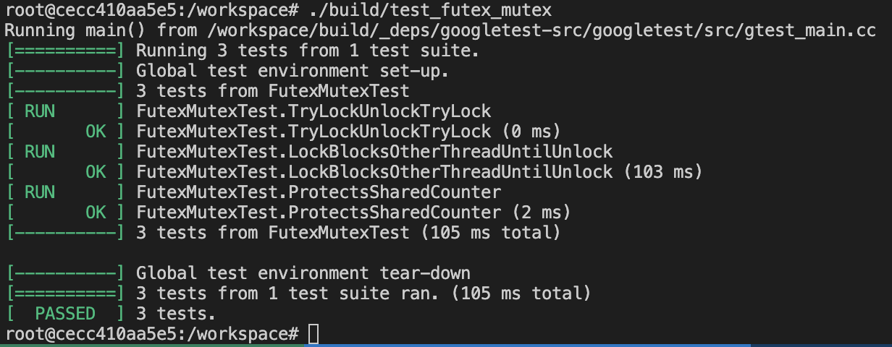

# HW3 — std::mutex 

Реализация класса:

```cpp
class FutexMutex {}
```
Сборка из /workspace Docker:
```bash
cmake -S . -B build
cmake --build build  
```
Результат запуска тестов:
```bash
./build/test_futex_mutex
```

