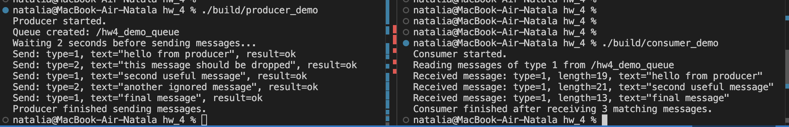

# HW4 — lock-free MPSC очередь сообщений

Реализация структур:
```cpp
struct MessageHeader {}
struct QueueHeader {}
struct MessageSlot {}
struct ReceivedMessage {}
```

Реализация классов:

```cpp
class ProducerNode {}
class ConsumerNode {}
```

Очередь:
- реализована на основе кольцевого буфера
- размещена в shared memory
- использует общий заголовок сообщения: `type`, `length`


Сборка из hw_4:
```bash
cmake -S . -B build
cmake --build build
```
Результат работы:

Запуск в параллельных терминалах
```bash
./build/producer_demo
```
```bash
./build/consumer_demo
```

