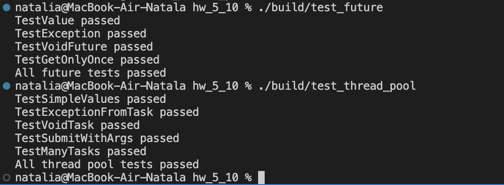

# HW5 — ThreadPool

Реализация структуры:
```cpp
struct SharedState {}
```

Реализация классов:

```cpp
class Future {}
class ThreadPool {}
```

Сборка из hw_4:
```bash
cmake -S . -B build
cmake --build build
```
Результат работы:

Тесты `test_future.cpp` - тесты для `Future`

```bash
./build/test_future
```

Тесты `test_thread_pool.cpp` — тесты для `ThreadPool`

```bash
./build/test_thread_pool
```

